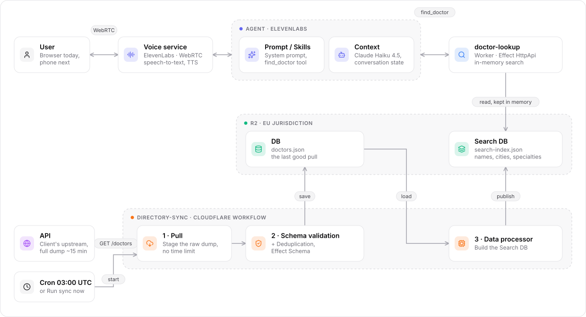
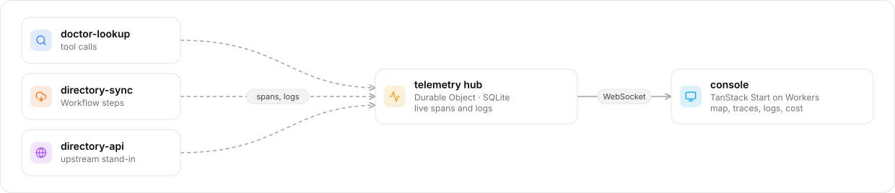

# Doctor directory voice agent

A phone-style voice agent that tells callers where a doctor practices, how to reach them and when they work, answered from a directory that is refreshed from a slow upstream API.

## TL;DR

- **What it does:** a caller asks, in English or Czech, for a doctor by name, or for "an oncologist in Bucharest available next Monday at 5 pm". The agent answers with clinic, address (street names in Romanian), phone, hours, languages, experience and rating, read from a verified lookup, never from the model's memory.
- **Two halves:** *serving callers* (ElevenLabs agent → `doctor-lookup` Worker → Search DB) and *keeping data fresh* (a Cloudflare **Workflow** pulls the ~15-minute full dump, validates and deduplicates it, publishes the Search DB).
- **Stack:** TypeScript and **Effect 4** in a **Bun** monorepo on **Cloudflare** (Workers, Workflows, R2, Durable Objects, Cron Triggers); voice by **ElevenLabs Agents** with Claude Haiku 4.5. No servers, no containers.
- **Observable:** every Worker streams Effect spans and logs live to a Durable Object; a console shows a service map, traces, logs, escalations, call history, per-service cost and live provider configuration.
- **Cost today:** ElevenLabs about $0.10–0.20 per 1–2 minute call; Cloudflare usage fits in the $5/month Workers plan with room for millions of lookups.
- **Main risks:** the console is public by choice, the upstream only offers full dumps without stable IDs, voice recordings are kept indefinitely by ElevenLabs, and some agent behavior is enforced by prompt rather than code. See [Risks](#risks).
- **How it was built:** in one day with oh-my-pi (`omp`) and several AI coding agents: I set the brief, the architecture and the product decisions; the coding agents wrote and deployed the code. See [How this was built](#how-this-was-built).

Live: [console](https://doctor-console.it-c89.workers.dev) · [talk to the agent](https://elevenlabs.io/app/talk-to?agent_id=agent_4201m39wmxxvf76snhp94gwajr7c)

## Architecture

The original sketch ([docs/architecture-sketch.png](docs/architecture-sketch.png)) as it is built now. Names from the sketch are kept in each box.

<picture>
  <source media="(prefers-color-scheme: dark)" srcset="docs/diagrams/architecture-dark.svg">
  
</picture>

Every Worker also reports to the observability side:

<picture>
  <source media="(prefers-color-scheme: dark)" srcset="docs/diagrams/observability-dark.svg">
  
</picture>

The diagrams are generated: edit `docs/diagrams/render.ts`, then `bun run docs:diagrams`.

| Sketch | Built as | Where |
|---|---|---|
| User | Browser via the console (WebRTC); a Twilio number is the next step | `apps/console` |
| Voice service | ElevenLabs Agents: Scribe realtime speech-to-text, Flash v2 text-to-speech, turn-taking | ElevenLabs |
| Agent · Prompt/Skills | System prompt and the `find_doctor` webhook tool, versioned in the repo; `bun run agent:push` updates ElevenLabs, `bun run agent:check` reports drift | `apps/doctor-lookup/agent` |
| Agent · Context | Claude Haiku 4.5, temperature 0; the conversation is the context | ElevenLabs |
| Search DB | `search-index.json` in R2, loaded into each `doctor-lookup` instance | `packages/shared/src/search-index.ts` |
| API | The client's directory API; `directory-api` reproduces it (bearer token; nothing for 15 minutes, then the full JSON) | `apps/directory-api` |
| Schema validation, Deduplication | Workflow step 2: Effect Schema per record, exact duplicates dropped | `apps/directory-sync/src/ingest.ts` |
| DB | `doctors.json` in R2, the last good pull | `apps/directory-sync` |
| Data processor | Workflow step 3: normalized names, cities, counties, specialties | `packages/shared/src/search-index.ts` |
| *(new)* Observability | Telemetry hub (Durable Object) and the console | `apps/telemetry`, `apps/console` |

## Technology

| Choice | Why |
|---|---|
| **Cloudflare Workers** | No servers to run; `doctor-lookup` answers from the data center nearest the caller; scales per request. |
| **Cloudflare Workflows** for the sync | The upstream needs ~15 minutes to answer. A Cron Trigger invocation may not run longer than 15 minutes; a Workflow step has no wall-clock limit, and each step retries on its own, so a failed publish does not repeat the pull. Verified: a run took 15 min 5 s and completed. |
| **R2 (EU jurisdiction)** | 7,029 records are two JSON objects: no database needed. EU jurisdiction keeps the data in the EU; no egress fees. |
| **Durable Object** for telemetry | One live hub with SQLite: stores the recent 5,000 events and pushes them to the console over WebSocket. |
| **Effect 4** | Typed services and layers (fakes in tests), Schema validation at every boundary, HttpApi with an OpenAPI contract, retries and timeouts, and native tracing that joins Workers into one trace. |
| **ElevenLabs Agents** | Speech quality and sub-second turns without running speech models; built-in language detection (English ⇄ Czech) and tool calling. |
| **Claude Haiku 4.5** | Fast and cheap enough for voice turns; temperature 0. |
| **TanStack Start + shadcn (Base UI)** | The console: server functions for provider APIs, React UI, deployed as a Worker. |
| **Bun workspaces, Biome, tsc** | One lockfile, one lint/format config, strict types across all apps. |

## How it works

**A call.** The caller talks to the ElevenLabs agent. When it has a name, or a city and specialty, it calls `find_doctor` (HTTPS, bearer token, `X-Conversation-Id` header). `doctor-lookup` answers from its in-memory index:

- `found`: clinic, address, phone, hours, languages, experience, rating; the only shape that carries contact details.
- `list`: doctors of a specialty in a city, best rated first, optionally filtered by weekday, hour and language.
- `ambiguous`, `not_found` (with "did you mean"), `invalid_request`, `unavailable`: each tells the agent exactly what to ask or say.

The prompt forbids the agent from answering existence questions or addresses from its own knowledge; addresses come only from a `found` result.

**A sync.** The cron (or the console) starts a Workflow instance, unless the last one is still running: pull the dump into `incoming/<run id>.json` (one file per run, deleted once saved), validate and deduplicate into `doctors.json` (refused if it has fewer than 90% of the previous doctor count, or is not JSON), then build and publish `search-index.json`. `doctor-lookup` instances check for a new version at most every 10 seconds and swap it in without a redeploy; requests on a new instance each load it until one has (a request may not wait on another request's I/O in Workers), and a failed read is retried on the next request.

**Observability.** Each Worker reports span starts, span ends and logs to the telemetry hub while it runs, so a 15-minute pull is visible as it happens. Trace context propagates over HTTP, so the sync and the upstream appear in one trace; tool calls carry the ElevenLabs conversation id.

## Operating it

The [console](https://doctor-console.it-c89.workers.dev) shows:

- **Service map:** live flow per edge, each box with its stack, status and cost this month; hover for protocol details, click for hosting, live configuration (from the Cloudflare and ElevenLabs APIs) and usage.
- **Traces and logs:** waterfall per request or sync run; logs filtered by service, level and text.
- **Voice panel:** call the agent from the browser; **History** lists every call with ElevenLabs' summary, cost, tokens and transcript, linked to backend traces.
- **Escalations:** when the data cannot be read, the agent tells the caller it cannot answer now, that the problem was escalated, and to call back; `doctor-lookup` logs an error with the conversation id and the query. The header counts them; the traces list and map highlight them.
- **Simulate outage:** a switch that makes every lookup unavailable, to rehearse escalations.
- **Run sync now:** starts the same Workflow as the cron; while a run is going, it follows that run instead of starting another.

## Risks

| Risk | Impact | Mitigation / next step |
|---|---|---|
| **Console is public** (decided for the demo) | Anyone with the URL reads every call: full transcripts and ElevenLabs' summaries, callers' queries and conversation ids. It also shows Worker configuration (bindings, plain-text variables, secret names but never values), usage and cost, and anyone can switch on the outage simulation or start a sync (one run at a time, about 15 minutes of upstream load). | Put it behind Cloudflare Access before real callers; until then, treat every call as public. |
| **Upstream offers only full dumps, no stable IDs** | Every sync moves the whole dataset (~15 min); deduplication can only drop exact copies; namesakes stay separate (the sample has 616 e-mails shared by 1,285 records). | Ask the client for an incremental "changed since" endpoint and stable IDs. |
| **Voice data retention** | ElevenLabs records calls and keeps conversations indefinitely (retention −1); audio is processed outside the EU even though the directory is in EU R2. | Set a retention period, decide on recording, sign a DPA; the console deliberately does not expose recordings. |
| **Prompt-enforced behavior** | Some rules (no guessing, language switching, not offering transfers) depend on the model following the prompt; it once reasoned about a city on its own. | Rules that matter are also in code: addresses and phones only exist in `found` results; lists are capped at 3 names. Keep regression calls as tests. |
| **Personal data in answers** | Phone numbers, hours and ratings are read out to anyone who calls. | Confirm with the client which fields may be disclosed; the schema drops e-mail. |
| **Single vendors** | ElevenLabs and Cloudflare outages stop calls or lookups. | Lookups degrade to an escalation; a second voice provider would be a larger change. |
| **Index format changes** | A new Search DB format is unreadable by older `doctor-lookup` instances until they are redeployed. | Deploy the sync, run it, deploy the lookup right after. A format version makes older instances refuse the new file and keep serving the one they have. |
| **Agent limits** | 3 concurrent calls, 50 calls a day, 300 s per call. | Raise in ElevenLabs when real traffic starts. |
| **Time zone** | The agent resolves "tomorrow" from UTC; around midnight Romanian time it can pick the wrong weekday. | Set the agent time zone to Europe/Bucharest. |
| **Short-lived API key** | The console's ElevenLabs key expires after 7 days; call history, cost and configuration panels stop until it is replaced. | Replace it with a long-lived, read-only key. |
| **Telemetry retention** | The hub keeps the latest 5,000 events; older traces are gone (Cloudflare Workers Logs keep their own copy). | Export to a long-term store (e.g. OTLP) if audits need it. |
| **Pre-release dependencies** | Effect 4 is a release candidate (`4.0.0-rc.117`) and TypeScript 7 is the new native compiler; APIs can change between versions. | Versions are pinned exactly (Bun catalog and lockfile); upgrade deliberately, with CI running checks and tests on every push. |
| **Tool enums follow the data** | The `specialty` and `language` values the agent may pass are listed in `find-doctor.tool.json`; a specialty new upstream would be missing, so the agent could not ask for it. | `bun run agent:check` compares the enums with the published Search DB (and the prompt and tool with ElevenLabs); run it after syncs that change the data. |

## Scaling

- **More callers.** See [Scaling with traffic](#scaling-with-traffic) below.
- **Phone lines and languages.** Attach Twilio numbers to the same agent; add language presets. Street names stay Romanian by rule.
- **Bigger directories.** See [How far in-memory search goes](#how-far-in-memory-search-goes) below.
- **Bigger or slower dumps.** Workflow steps have no wall-clock limit; CPU per step can be raised to 5 minutes. With a streaming parser and staged chunks the pull scales past what one step holds in memory; an incremental upstream API removes the full pull altogether.
- **More sources or clinic networks.** One Workflow per source (parallel steps), one Search DB per network, the same lookup code.
- **Observability.** The telemetry hub is a single Durable Object; see [Scaling with traffic](#scaling-with-traffic) for where it saturates and what to change.

### Scaling with traffic

A 1–2 minute call makes about 1–3 `find_doctor` lookups, so even 1,000 simultaneous calls are only ~50–150 lookups per second: little for Cloudflare. The limits are elsewhere.

| Part | How it scales | Where it stops | What to change |
|---|---|---|---|
| **ElevenLabs agent** | ElevenLabs runs the speech models and the LLM | **The first real limit:** capped at 3 concurrent calls and 50 a day (demo sizing); the ceiling is set by the ElevenLabs plan; overflow bursting is available but off | Raise the limits and plan; Enterprise for high volume |
| **doctor-lookup** | Workers start instances automatically near the caller; no shared state | ~33 ms of CPU per lookup; a new instance first loads the 2.4 MB index (~340–370 ms in traces); warm lookups ~140–350 ms end to end, cold up to ~1.1 s | Nothing at this scale; beyond one country, shard the Search DB ([below](#how-far-in-memory-search-goes)) |
| **R2** | Parallel reads | Each warm instance checks for a new index at most every 10 s: with 1,000 instances ~8.6 M checks a day, about $3/day | Cache the version check (e.g. in KV) |
| **directory-sync Workflow** | Independent of caller traffic | One run a day | Nothing |
| **telemetry hub** | **Does not scale:** one Durable Object, one request at a time | Every lookup sends ~10 events in 1–2 batches, written to SQLite and broadcast to open consoles; Cloudflare's guidance is roughly 1,000 requests per second per object, so it saturates in the hundreds of lookups per second. Callers are not affected (reporting never blocks a lookup and failures are ignored), but events are lost | Sample traces (e.g. 1–10%, always keep errors and escalations), shard the hub by service or time, or export to an analytics store |
| **console** | Anyone can open it | Every open browser queries the ElevenLabs and Cloudflare APIs (cached a minute per browser); many viewers hit their rate limits | Cache on the server; put it behind Cloudflare Access |

**Cost is dominated by ElevenLabs.** 10,000 calls a day at ~$0.15 each is ~$1,500/day (~$45k/month) at list price. The same traffic is ~30k lookups a day, ~1 M Workers requests a month: still inside the $5 plan, which includes 10 M. The levers are call length, tokens per turn and ElevenLabs pricing, not Cloudflare.

**Before real traffic, in order:**

1. Raise the ElevenLabs agent limits.
2. Sample telemetry, so the single hub is not the part that falls over.
3. Rate-limit the public `find_doctor` endpoint: it requires a bearer token but has no request limit.
4. Put the console behind Cloudflare Access, which also removes its per-viewer API load.

### How far in-memory search goes

Each `doctor-lookup` instance holds the whole Search DB in memory. Measured on the sample data: **347 bytes per doctor** serialized and **~380 bytes per doctor** in the heap. A Worker has 128 MB, so one instance tops out around **260,000 doctors**, and a new instance would first parse ~90 MB. Comfortable up to roughly 100–200 thousand: a whole country (Romania has ~60,000 doctors).

For scale: WHO counts about 13 million physicians worldwide, so realistic targets are a country, the EU (~2 M) or the world (~13 M). A billion is useful as a test of the design.

What keeps it scalable at any size: callers never scan the directory. Every question is narrow (a surname, usually a city, maybe a specialty, day or language), so each lookup can read a small slice instead of holding everything.

| Scale | Lookup | Ingest |
|---|---|---|
| **up to ~200 k** (today, one country) | Whole index in memory; no change | Full daily dump, as now |
| **~200 k – ~20 M** (EU, world) | Search DB sharded by city in R2; a lookup loads only the shards it needs (kilobytes to a few MB) and keeps recent ones in memory; a surname-keyed index covers cross-city name lookups | Full dump processed in parallel chunks |
| **~1 B** | Distributed key-value or wide-column store (Cassandra/ScyllaDB, DynamoDB or Workers KV) with precomputed answers: `phonetic(surname)#city → ids`, `city#specialty → ids by rating with working days`, `id → record`. Each lookup is a few point reads of ~10 ms, never a scan. "Did you mean" from precomputed phonetic keys, or a search engine (e.g. OpenSearch) for that path only | A daily full dump is impossible (~450 GB in one response): the upstream must send changes since a timestamp with **stable IDs**, or bulk-export files to object storage for parallel processing |

What else changes at a billion:

- **Deduplication** needs stable IDs or probabilistic record matching; dropping exact copies is no longer enough.
- **Publishing** can no longer swap one file atomically; each shard is versioned and switched on its own.
- **Conversations:** name collisions multiply, so the agent must collect city (and specialty or clinic) before looking up. The lookup already returns `ask_for` with the next field to ask, and lists stay capped at three names.
- **Cost** moves from serving to ingesting: reads stay cheap (Workers KV about $0.50 per million), keeping a billion records current is the expense.

The agent and the `find_doctor` contract stay the same at every tier; only the data layer behind `doctor-lookup` and the sync change.

## Cost

Measured this month in the console (live numbers are in its header):

- **ElevenLabs:** about $0.10–0.20 per call of 1–2 minutes (voice minutes plus LLM tokens, e.g. 46,724 tokens in and 655 out for a 99-second call).
- **Cloudflare:** Workers Paid plan $5/month, shared by all Workers on the account. This project's usage is a fraction of a cent at list price (e.g. `doctor-lookup` 466 requests and 15.5 CPU-seconds); R2 stays in the free tier.

## How this was built

Built on 24 September 2026, in one day, using [oh-my-pi](https://github.com/can1357/oh-my-pi) (`omp`) with several AI coding agents, Claude among them, working in this repository and against the live Cloudflare and ElevenLabs accounts.

**My part:**
- The brief and the architecture sketch ([docs/architecture-sketch.png](docs/architecture-sketch.png)): two services, one keeping the data fresh from the slow API and one serving callers.
- The stack: Bun monorepo, TypeScript and Effect 4, Cloudflare, ElevenLabs Agents.
- Product decisions: English and Czech with Romanian street names never translated; which doctor details the agent may disclose (phone, hours, languages, experience, rating; not e-mail); escalating unanswerable calls; moving the sync to a Workflow once the upstream took 15 minutes; a public console for the demo.
- Directing and reviewing each step, and testing with real calls: several agent behaviors (tool use, listing by city and specialty, rating order, the "one moment" filler) were fixed after my test calls.

**The coding agents' part:** the detailed design within that frame (the Search DB format, the telemetry hub, the staged Workflow steps), the code and tests, deployments, checking platform limits against the documentation, and this README from my direction.

**How it was checked:** Biome and TypeScript on every change, 24 unit tests on the lookup (including a failed Search DB read and concurrent first requests), the sync (including overlapping runs) and schedule parsing, and end-to-end checks in production: real agent calls in English and Czech, a 15-minute sync Workflow run, the outage switch with a real escalated call, and every console panel in a browser. CI runs the checks and tests on every push.

## Repository

```
apps/
  doctor-lookup/    find_doctor API (Effect HttpApi), outage switch; agent/ holds the prompt, tool definition and push/check script
  directory-sync/   the sync Workflow: pull, validate + deduplicate, publish
  directory-api/    stand-in for the client's slow upstream API
  telemetry/        Durable Object hub for live spans and logs
  console/          operations console (TanStack Start, shadcn)
packages/shared/    doctor schema, search index, telemetry, R2 and auth helpers, deployment IDs
dev/gateway/        local-only router for running several Workers together
docs/               the original architecture sketch and the generated diagrams
.github/workflows/  CI: Biome, TypeScript and tests on every push
```

## Development

Requirements: Bun, a Cloudflare account (Workers Paid for Workflows), an ElevenLabs account. Place the dataset at `healthcare_data.json` in the repo root (not committed).

```sh
bun install
for f in apps/*/.dev.vars.example; do cp "$f" "${f%.example}"; done
bun run seed:local            # upload the dataset to the local R2 of directory-api
bun run dev                   # gateway on :3000 (lookup, /sync, /telemetry/*), directory-api on :4000
bun run sync:now              # start a sync Workflow locally
bun run --filter @doctor-directory/console dev
bun run check                 # Biome and TypeScript
bun test
bun --env-file=.env.production run agent:check   # prompt, tool and enums vs ElevenLabs and the data
bun --env-file=.env.production run agent:push    # update the agent's prompt and tool from agent/
```

Deploy order: `telemetry` first (the others bind to it), then `directory-api`, `directory-sync`, `doctor-lookup`, `console`. Secrets are set with `wrangler secret put`: `TOOL_TOKEN` (doctor-lookup); `SOURCE_URL`, `SOURCE_TOKEN`, `SYNC_TOKEN` (directory-sync); the same `SOURCE_TOKEN` (directory-api); `SYNC_TOKEN`, `CF_ANALYTICS_TOKEN`, `ELEVENLABS_API_KEY` (console).

A fork sets its own Cloudflare account, ElevenLabs agent and tool IDs in `packages/shared/src/deployment.ts` (identifiers, not secrets) and its own bucket names in each `wrangler.jsonc`.

License: [MIT](LICENSE).
